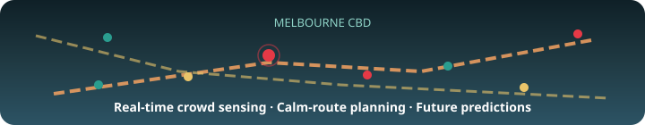
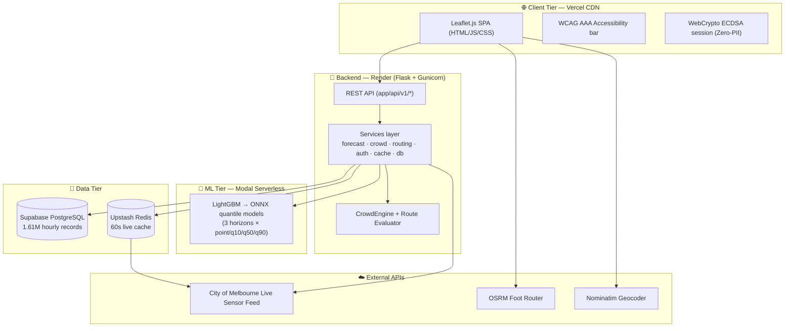
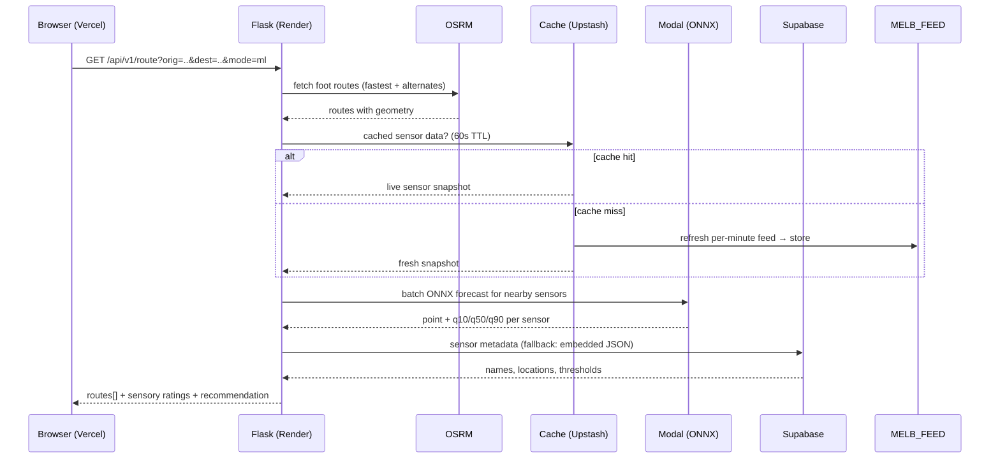
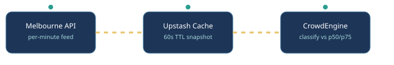
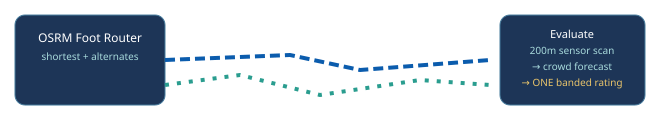
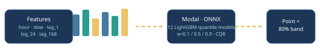

<div align="center">

# 🧭 Melbourne CBD — Sensory-Aware Route Planning & Real-Time Navigation

**A low-stimulation navigation platform for neurodivergent and sensory-sensitive commuters**



**Live frontend** &nbsp;·&nbsp; [cbd-calm-route.vercel.app](https://cbd-calm-route.vercel.app) &nbsp;|&nbsp; **Live API** &nbsp;·&nbsp; [fit5120-backend-y5zg.onrender.com](https://fit5120-backend-y5zg.onrender.com)

---

</div>

## 📋 Table of Contents

1. [What is this?](#-what-is-this)
2. [Features](#-features)
3. [System Architecture](#-system-architecture)
4. [How each feature works — behind the scenes](#-how-each-feature-works--behind-the-scenes)
5. [Tech Stack — what, why, and how it's configured](#-tech-stack--what-why-and-how-its-configured)
6. [Environment Variables](#-environment-variables)
7. [Repository Layout](#-repository-layout)
8. [Running Locally](#-running-locally)
9. [Deployment](#-deployment)

---

## 🌍 What is this?

Melbourne's CBD is one of Australia's busiest pedestrian zones — dense crowds, constant movement and unpredictable noise can make independent travel overwhelming for **neurodivergent and sensory-sensitive people**.

This platform turns **City of Melbourne's live pedestrian sensor network** (100+ sensors, per-minute updates) into a navigational aid that values **sensory calm over raw speed**:

- 🗺️ A **real-time map** of crowd density across the CBD — color-coded, plain-language, WCAG-compliant
- 🧭 **Route planning** that compares the *fastest* path vs the *calmest* path
- 🔮 **Machine-learning predictions** of crowd levels hours ahead — with confidence bands, not black boxes
- 🎗️ **Zero-PII privacy** — anonymous sessions, no account, no tracking

---

## ✨ Features

| Feature | What the user sees | Behind the scenes |
| :--- | :--- | :--- |
| 🗺️ **Real-time sensory map** | Color-coded dots (🟢 Calm / 🟡 Moderate / 🔴 Busy) over Melbourne CBD | Live per-minute City of Melbourne feed → aggregated hourly → compared against per-sensor historical p50/p75 thresholds |
| 🧭 **Calm-route planning** | Two routes drawn: "Shortest path" vs "Recommended calm route", each with a single sensory rating + breakdown | OSRM foot router computes paths → 200m sensor scan along each → per-sensor crowd forecast → single banded rating (LOW/MEDIUM/HIGH) |
| 🔮 **Future predictions** | "62% chance of overstimulation at Bourke St, 3 hours from now" with an 80% confidence band | Trained LightGBM quantile models (α = 0.1/0.5/0.9) exported to ONNX → served via Modal serverless → CQR calibration adjusts band width |
| 🎗️ **Accessibility-first UI** | High-contrast toggle, text scaling (A−/A+), no flashing animations, plain-language labels | WCAG 2.1 AAA design system, sensory labels always accompanied by text badges (never color alone) |
| ⚡ **Live feed resilience** | If the live feed drops, ratings switch to historical averages and are labelled **"Estimated"** | Multi-tier fallback chain: live feed → Supabase recent history → embedded synthetic data |

---

## 🏗️ System Architecture



**One request, traced end-to-end** (e.g. `GET /api/v1/route`):



---

## 🧠 How each feature works — behind the scenes

### 1. 🗺️ Real-time sensory map



**The pipeline:**

1. **Ingest** — pull the per-minute City of Melbourne feed, dedupe, aggregate to hourly buckets
2. **Cache** — snapshot stored in Upstash Redis (60s TTL, matching the feed cycle)
3. **Classify** — each sensor's count vs its own historical p50/p75 → 🟢 Calm / 🟡 Moderate / 🔴 Busy
4. **Render** — Leaflet dots with plain-language labels + legend (never color alone — WCAG)

**Resilience chain:** live feed → Supabase history → embedded synthetic data; if everything upstream fails, ratings fall back to historical averages and are labelled *estimated*.

---

### 2. 🧭 Calm-route planning (the core feature)



**The pipeline:**

1. **Geocode** addresses (Nominatim, cached 1h in Upstash) → **fetch routes** from OSRM foot router (shortest + alternates)
2. **Scan** each route's geometry; find sensors within **200 m**
3. **Forecast** their crowds — `ml` mode: one batched Modal ONNX call; `rule` mode: historical hour/dow averages
4. **Rate** each route with the worst sensor level → one band (LOW/MEDIUM/HIGH), highlight calmest + fastest
5. **Honesty** — no sensors nearby → `UNKNOWN`/"No Sensor Coverage" (never misleading "Calm"); historical-based ratings flagged `rating_estimated` + labelled "Estimated from historical averages"

---

### 3. 🔮 Future predictions (ML)



**Behind the scenes:**

- **Train** — LightGBM quantile models (α = 0.1/0.5/0.9) per horizon (1h/6h/24h) on 1.61M hourly records; features = calendar + lag-1/24/168 + rolling means
- **Calibrate** — CQR (split-conformal) fixes band coverage ≈74% → 80% (`results/calibration.json`)
- **Export** — `scripts/export_onnx.py` → ONNX binaries (sub-5 ms, <80 MB RAM)
- **Serve** — Render never loads models; `scripts/modal_app.py` runs on Modal serverless, Render posts feature rows and reads back point + q10/q50/q90 + calibrated band
- **Explainable** — `/api/v1/importance` serves feature-importance tables; rule mode uses transparent historical averages
- **Future-only** — past datetimes rejected with 400 on `/api/v1/predict` & `/api/v1/route`; the UI explains which date/time was invalid

---

### 4. 🎗️ Zero-PII authentication

- Browser generates an **ECDSA P-256 keypair** (WebCrypto) → public key hashed → anonymous session
- Backend issues an anonymous JWT; preferences stored **keyed only by session hash** — never by name/email/device
- Fully **APP / Privacy Act 1988 compliant** (`compliance: "APP_1988_ZERO_PII"`)

---

## 🧰 Tech Stack — what, why, and how it's configured

| Layer | Technology | How it's configured |
| :--- | :--- | :--- |
| **Frontend** | HTML5 + Vanilla ES6 + CSS3 + **Leaflet.js 1.9.4** | Served from `frontend/` by **Vercel**; `vercel.json` rewrites `/api/*` → Render backend |
| **Backend** | **Flask 3.0 + Gunicorn** | `wsgi.py` = production entry (`gunicorn wsgi:app`); app factory in `app/__init__.py`; blueprints under `app/api/v1/` |
| **Hosting** | **Vercel** (frontend) + **Render** (backend) | Render service `fit5120-backend` (Oregon, Python 3.11.8), rootDir `backend`, deploys from `main` |
| **ML** | **LightGBM → ONNX Runtime** | Trained offline (`src/`), exported via `scripts/export_onnx.py`, served on Modal serverless |
| **Serverless ML** | **Modal** | `scripts/modal_app.py` via `modal deploy`; Render calls 3 endpoint URLs from env vars |
| **Database** | **Supabase PostgreSQL** | `scripts/supabase_schema.sql` + seed scripts; `DatabaseService` reads via PostgREST |
| **Cache** | **Upstash Redis** | `CacheService` calls `GET/POST {url}/get\|set/{key}` with bearer token; 60s TTL; in-memory fallback |
| **Routing** | **OSRM Foot Router** (public API) | `router.project-osrm.org/route/v1/foot` via `urllib` |
| **Geocoding** | **Nominatim (OSM)** | `nominatim.openstreetmap.org/search`, cached 1h in Upstash |
| **Data feed** | **City of Melbourne Open Data** | Per-minute pedestrian counts, 100+ sensors; dedup + hourly aggregation in `src/data/load.py` |

### 🔗 How the pieces talk to each other



---

## 🔐 Environment Variables

All secrets live in Render's dashboard (never in the repo). Copy `.env.example` for local development:

| Variable | Used for |
| :--- | :--- |
| `FLASK_ENV` | `production` / `development` / `testing` |
| `SECRET_KEY` | Anonymous JWT signing |
| `DATA_TYPE` | `real` (Supabase) vs `synthetic` (embedded demo data) |
| `SUPABASE_URL` / `SUPABASE_KEY` | PostgREST access to historical counts + user preferences |
| `UPSTASH_REDIS_URL` / `UPSTASH_REDIS_TOKEN` | Live-feed response cache (60s TTL) |
| `MODAL_API_URL` | Modal serverless fallback endpoint (rule-based UI) |
| `MODAL_ML_API_URL` | Modal ONNX single-sensor forecast endpoint |
| `MODAL_ML_BATCH_API_URL` | Modal ONNX batched forecast endpoint (route evaluation) |
| `CACHE_TTL_SECONDS` | Default cache expiry (default 60) |
| `FRONTEND_URL` | Vercel URL that backend HTML routes redirect to |

---

## 📁 Repository Layout

```
FIT5120-onboarding/
├── backend/                  # Flask backend (deployed to Render)
│   ├── app/
│   │   ├── api/v1/           # REST blueprints: sensors, routing, forecast, experiments, auth
│   │   ├── services/         # forecast · crowd · routing · auth · cache · db
│   │   ├── __init__.py       # application factory (wires all services)
│   │   ├── crowd.py          # CrowdEngine: thresholds, classification, route evaluation
│   │   └── forecast_service.py
│   ├── scripts/              # supabase seed, ONNX export, Modal app
│   ├── src/                  # ML pipeline: config, features, models, experiment, report
│   ├── results/              # ONNX models, calibration.json, evaluation reports
│   ├── data/                 # sensor metadata + training sensor IDs
│   ├── tests/                # 6 test suites
│   ├── wsgi.py               # gunicorn entry point
│   └── render.yaml           # Render blueprint
├── frontend/                 # static SPA (deployed to Vercel)
│   ├── templates/            # map.html, predict.html, features.html, help.html…
│   ├── static/               # app.js, map.js, predict.js, style.css
│   └── vercel.json           # route rewrites + /api proxy to Render
└── README.md
```

---

## 🚀 Running Locally

```bash
# backend
cd backend
python -m venv .venv && .venv/Scripts/activate     # Windows
pip install -r requirements.txt
cp .env.example .env                                # fill in keys
python app/server.py --port 8000

# tests
python -m pytest tests/ -q                          # 12 tests, all green

# frontend (static — open directly or serve):
cd frontend && python -m http.server 5000
```

---

## 🌐 Deployment

| Tier | Service | Branch | URL |
| :--- | :--- | :--- | :--- |
| Frontend | Vercel · `cbd-calm-route` | `frontend/` root | https://fit-5120-onboarding-ten.vercel.app/ |
| Backend | Render · `fit5120-backend` | `main` (auto-deploy) | https://fit5120-backend-y5zg.onrender.com |
| ML | Modal · `melbourne-cbd-crowd-ml` | deployed app | via Modal |
| Cache | Upstash Redis | `endless-terrapin-181746` | REST endpoint |
| DB | Supabase | `hklrfdgxmuixcbymvdpo` | PostgREST |

**Release flow:** features land on `developer` → fast-forward to `main` → Render auto-deploys; frontend is deployed manually via Vercel.

---

<div align="center">

*Built for calmer commutes in Melbourne's CBD. 💚*

</div>
