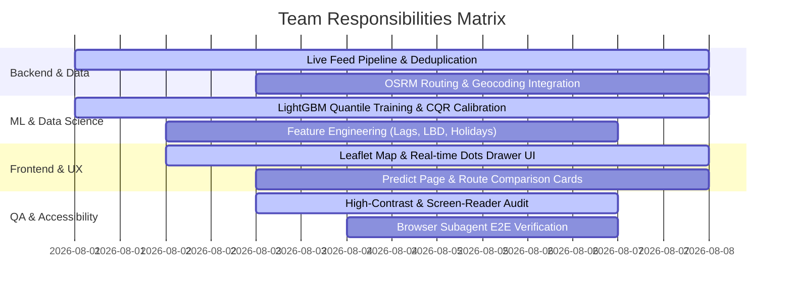

# System Design Document (SDD)
## Melbourne CBD Pedestrian Sensory Load & Real-Time Navigation Platform

**Version:** 2.0 (Post-Implementation Architecture)  
**Target Audience:** Engineering Team, Data Science Team, UX/Accessibility Leads  
**Status:** Deployed & Verified (Local / Network Server on Port 8000)

---

## 1. System Overview & Architecture Philosophy

### 1.1 Mission & Vision
The Melbourne CBD Pedestrian Sensory Load & Navigation Platform provides real-time, low-stimulation walking route recommendations for neurodivergent individuals. Rather than optimizing purely for distance or speed, the system balances travel time against sensory load (crowd density, noise, visual stimulation).

### 1.2 Core Architectural Principles
1. **Neurodivergent-First Design System**:
   - Zero animations or flashing elements.
   - High-contrast toggle (`.hc`) and persistent text scaling (`A-` / `A+`).
   - Plain-language sensory status labels (**Calm**, **Moderate Activity**, **Busy / Overstimulating**) accompanied by explicit text badges (never relying on color alone).
2. **Instant Real-Time Map Landing**:
   - The user opens the web application directly to a full-bleed map of Melbourne CBD populated with real-time sensory dots. No upfront forms or required selections.
3. **Seamless Address-to-Address Routing**:
   - Accepts exact street addresses (e.g. `455 Elizabeth Street`, `350 Queen Street`) and landmarks.
   - Automatically computes and compares the **Shortest Path** against **Recommended Calm Routes** without requiring user prompting.
4. **Hybrid Rule Engine + Quantile ML Forecasting**:
   - **Real-Time View (`/`)**: Combines live per-minute sensor feeds with historical sensor percentiles (`p50`, `p75`).
   - **Future Predictor (`/predict`)**: Uses trained LightGBM quantile regression models ($\alpha = 0.1, 0.5, 0.9$) calibrated via Split-Conformal Quantile Regression (CQR) to provide 80% likely prediction bands and overstimulation probabilities.

### 1.3 High-Level System Architecture Diagram

```mermaid
flowchart TD
    subgraph Data Sources
        DS1["Live Minute Feed (City of Melbourne API)"]
        DS2["Historical Hourly Counts (1.61M rows)"]
        DS3["Sensor Locations (103 sensors)"]
        DS4["OpenStreetMap / OSRM Foot Network"]
    end

    subgraph Backend Core (Python / Flask - port 8000)
        BC1["CrowdEngine (app/crowd.py)"]
        BC2["Nominatim Geocoder + Local Address Resolver"]
        BC3["OSRM Foot Router & Evaluator"]
        BC4["LightGBM ML Forecasting Service (src/models.py)"]
        BC5["Conformal CQR Calibration Engine (calibration.json)"]
    end

    subgraph Web APIs (app/server.py)
        API1["GET /api/map (Real-time 103 sensors)"]
        API2["GET /api/geocode (Address search)"]
        API3["GET /api/route (Shortest vs Calm Route comparison)"]
        API4["GET /api/predict (ML future forecast & CQR band)"]
    end

    subgraph Frontend Views (HTML5 / Vanilla CSS / ES6 JS / Leaflet.js)
        FE1["Real-Time CBD Map View (app/templates/map.html)"]
        FE2["Predict Future Crowd View (app/templates/predict.html)"]
        FE3["Help & Accessibility Guide (app/templates/help.html)"]
    end

    DS1 --> BC1
    DS2 --> BC1
    DS3 --> BC1
    DS4 --> BC2
    DS4 --> BC3

    BC1 --> API1
    BC2 --> API2
    BC3 --> API3
    BC4 --> API4
    BC5 --> API4

    API1 --> FE1
    API2 --> FE1
    API2 --> FE2
    API3 --> FE1
    API3 --> FE2
    API4 --> FE2
```

---

## 2. Dataset Registry & Data Pipeline Specification

### 2.1 Confirmed Datasets (All CC BY 4.0)

| Dataset | Role | Format / Update | Cleaning & Processing Rules |
| :--- | :--- | :--- | :--- |
| **Past Hour (counts per minute)** | Live "Calm Now" feed | Per-minute rolling CSV export | **Deduplication**: Deduplicated on `(location_id, datetime)`. Solves known City of Melbourne bug on sensors 67, 68, 69. Aggregated to local Melbourne hourly totals. |
| **Counts per Hour (Aug 2024–Aug 2026)** | Historical training dataset | 1,613,233 hourly rows | **Filtering**: Removed null counts and negative values. Filtered out sparse sensors with < 48 records. |
| **Sensor Locations** | Map coordinates & metadata | Static CSV (103 sensors) | Indexed by `location_id` with `latitude`, `longitude`, `sensor_description`. |
| **Pedestrian Line Network & OSM** | Foot path routing | OSRM API + OpenStreetMap | Queries live OSRM foot routing with straight-line fallback. |

### 2.2 Sensory Level Thresholding Engine
For each sensor $i$, historical counts are analyzed to derive empirical percentiles:
- $p_{50}$ (50th percentile baseline median)
- $p_{75}$ (75th percentile overstimulation boundary)

$$\text{Sensory Level} = \begin{cases} \mathbf{LOW \ (\text{Calm Quiet})}, & \text{count} < p_{50} \\ \mathbf{MEDIUM \ (\text{Moderate Activity})}, & p_{50} \le \text{count} \le p_{75} \\ \mathbf{HIGH \ (\text{Busy / Overstimulating})}, & \text{count} > p_{75} \end{cases}$$

---

## 3. Backend & API Specifications (`app/server.py`, `app/crowd.py`)

### 3.1 Server Environment
- **Framework**: Flask (Python 3.14)
- **Host & Port**: `0.0.0.0:8000` (Accessible on `localhost`, local Wi-Fi IP `192.168.x.x`, or public tunnel).

### 3.2 Endpoint Registry

#### 1. `GET /api/map`
Returns real-time status and counts for all 103 sensors.
- **Response**:
```json
{
  "timestamp": "2026-08-04T22:15:00",
  "sensors": [
    {
      "location_id": 1,
      "name": "Bourke Street Mall (North)",
      "latitude": -37.8134,
      "longitude": 144.9651,
      "current_count": 112.0,
      "level": "LOW",
      "sensory_label": "Calm (Quiet)",
      "sensory_advice": "Low crowd density — low noise & movement.",
      "p50": 340.0,
      "p75": 890.0
    }
  ]
}
```

#### 2. `GET /api/geocode?q={query}`
Geocodes exact building addresses (e.g. `455 Elizabeth Street`) or landmarks.
- **Response**:
```json
{
  "query": "455 Elizabeth Street",
  "results": [
    {
      "display_name": "453 - 455, Elizabeth Street, Melbourne",
      "latitude": -37.8084,
      "longitude": 144.9602,
      "source": "nominatim"
    }
  ]
}
```

#### 3. `GET /api/route?orig_lat=...&orig_lon=...&dest_lat=...&dest_lon=...&mode=rule|ml&datetime=...`
Queries OSRM walking paths, maps route coordinates to nearby pedestrian sensors within 200m radius, and compares Fastest vs Calm paths.
- **Response**:
```json
{
  "orig": {"lat": -37.8084, "lon": 144.9602},
  "dest": {"lat": -37.8104, "lon": 144.9588},
  "routes": [
    {
      "id": 0,
      "duration_min": 1.0,
      "distance_m": 410,
      "crowd_score": "LOW",
      "sensory_tag": "Calm (Quiet Path)",
      "is_fastest": true,
      "is_least_crowded": true,
      "remarks": ["Calm zone near QVM-Franklin St (North)"]
    }
  ],
  "recommendation": {
    "fastest_id": 0,
    "least_crowded_id": 0
  }
}
```

#### 4. `GET /api/predict?q=...|sensor_id=...&datetime=...`
Performs ML quantile regression forecast for a target location and future timestamp.
- **Response**:
```json
{
  "location_id": 1,
  "display_name": "Bourke Street Mall, Greek Precinct, Melbourne",
  "target_datetime": "2026-05-08T12:00:00",
  "point_pred": 672.0,
  "q10": 210.0,
  "q50": 672.0,
  "q90": 968.0,
  "band_cal": [210.0, 968.0],
  "sensory_level": "MEDIUM",
  "sensory_label": "Moderate Activity",
  "prob_exceed_p75": 1.0
}
```

---

## 4. Machine Learning & Calibration Engine (`src/`)

### 4.1 Model Specifications
- **Framework**: LightGBM Quantile Regression (`lgb_cpu`)
- **Direct Horizons**: 1-hour ($1h$), 6-hour ($6h$), and 24-hour ($24h$) forecasts.
- **Quantiles**: $\alpha \in \{0.1, 0.5, 0.9\}$ for 80% prediction intervals.

### 4.2 Split-Conformal Quantile Regression (CQR) Calibration
To guarantee empirical 80% coverage on unseen future data, prediction bounds are adjusted using CQR calibration residuals stored in `results/calibration.json`:

$$\text{Band}_{\text{calibrated}} = \left[ \max\left(0, \hat{q}_{0.1} - \eta\right), \ \hat{q}_{0.9} + \eta \right]$$

Where calibration parameters $\eta$ are:
- $1h$ horizon: $\eta = 2.48$
- $6h$ horizon: $\eta = 4.82$
- $24h$ horizon: $\eta = 4.41$

### 4.3 Overstimulation Exceedance Probability Estimator
Piecewise cumulative distribution function (CDF) linear interpolation calculates the exact probability $P(\text{count} > p_{75})$ that crowds will breach the overstimulation threshold:

```python
def estimate_exceedance_probability(q10: float, q50: float, q90: float, p75_threshold: float) -> float:
    # Interpolates empirical CDF across q10, q50, q90 relative to p75
    # Returns percentage 0.1% to 99.9%
```

---

## 5. Frontend & Accessibility Design System

### 5.1 Technology Stack
- **Structure**: Semantic HTML5 (`app/templates/*.html`)
- **Styling**: Vanilla CSS with Design System Tokens (`app/static/style.css`)
- **Logic**: Vanilla ES6 JavaScript (`app/static/map.js`, `app/static/predict.js`, `app/static/app.js`)
- **Mapping**: Leaflet.js with OpenStreetMap tiles

### 5.2 Responsive Layout Architecture
- `.maps-wrapper`: CSS Grid container with 380px left drawer sidebar (`.maps-sidebar`) and full-bleed map canvas (`.maps-canvas`).
- **Zoom-Dependent Information Density**:
  - `Zoom < 15`: Clean sensory status dots.
  - `Zoom >= 15`: Reveals live hourly counts, street names, and sensory advice notes.

### 5.3 Accessibility System (`localStorage` Persisted)
- **High Contrast Mode (`.hc`)**: Switches theme to pure high-contrast palette.
- **Font Scaling (`A-` / `A+`)**: Adjusts root font scale (`0.85rem` to `1.25rem`).
- **Motion-Free Design**: Zero auto-playing animations, smooth transitions, or flashing elements.

---

## 6. Team Responsibilities & Work Breakdown Structure (WBS)

To make collaboration smooth, team duties are divided into 4 clear roles:



### Role Breakdown:

#### 1. Backend & Data Infrastructure Engineer
- **Files**: `app/server.py`, `app/crowd.py`, `src/data/load.py`
- **Responsibilities**:
  - Maintain Flask REST API endpoints (`/api/map`, `/api/geocode`, `/api/route`, `/api/predict`).
  - Monitor City of Melbourne live per-minute feed ingestion and deduplication.
  - Manage OSRM foot routing requests and straight-line fallback logic.

#### 2. Machine Learning & Data Science Lead
- **Files**: `src/models.py`, `src/features.py`, `src/experiment.py`, `results/calibration.json`
- **Responsibilities**:
  - Maintain LightGBM multi-horizon quantile regression models.
  - Compute CQR calibration bounds and monitor pinball loss & coverage metrics.
  - Evaluate future feature additions (e.g. weather rainfall/temperature signals, AFL match schedules).

#### 3. Frontend & UX Lead
- **Files**: `app/templates/*.html`, `app/static/map.js`, `app/static/predict.js`, `app/static/style.css`
- **Responsibilities**:
  - Maintain Google-Maps-style UI layout and responsive Leaflet map controls.
  - Ensure instant address autocomplete suggestions for exact street numbers.
  - Render clear route comparison cards (Fastest Path vs Recommended Calm Route).

#### 4. Accessibility & QA Engineer
- **Files**: `tests/`, `app/templates/help.html`
- **Responsibilities**:
  - Enforce WCAG high-contrast styling (`.hc`) and font size scaling controls (`A-` / `A+`).
  - Run automated test suites (`pytest tests/`).
  - Perform browser verification for mobile and desktop screens.

---

## 7. Deployment & Environment Setup

### 7.1 Running Locally
```bash
# 1. Install dependencies
pip install -r requirements.txt

# 2. Run Flask server on port 8000
python app/server.py --port 8000
```
- Real-Time Map: [http://localhost:8000/](http://localhost:8000/)
- Future Predictor: [http://localhost:8000/predict](http://localhost:8000/predict)
- Help Guide: [http://localhost:8000/help](http://localhost:8000/help)

### 7.2 Sharing for Testing
- **Local Network (Same Wi-Fi)**: `http://192.168.x.x:8000/`
- **Public WhatsApp Sharing**: `npx --yes localtunnel --port 8000 --local-host 127.0.0.1`
